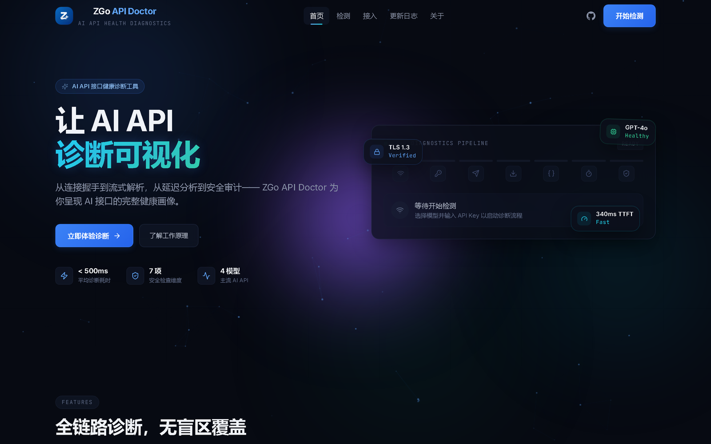
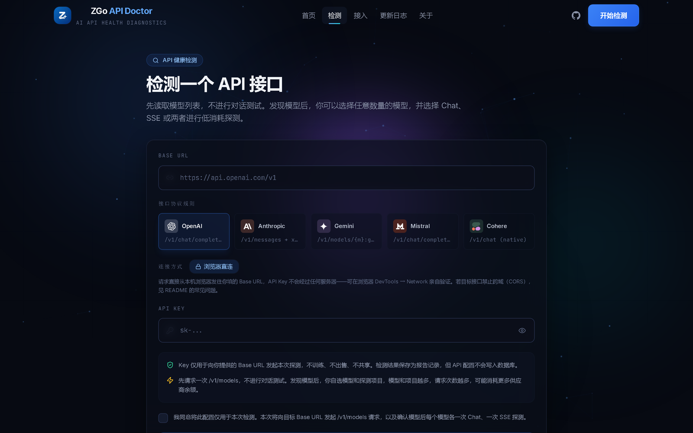
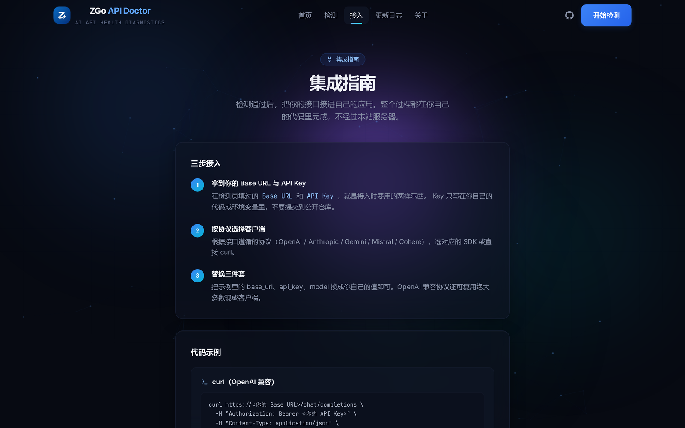

# ZGo API Doctor

**在浏览器里直接检测你的 AI API 接口是否真的能用。**

填入 Base URL 和 API Key，它会读取模型列表、对每个模型发一次真实请求、跑一次流式（SSE）探测，然后给出一份带 A/B/F 分级和健康评分的诊断报告。

**在线版本：<https://myzgo.cn>** —— 不想自己部署就直接用；它是本仓库代码的部署产物，源码与线上版本一致。想自己跑见[快速开始](#快速开始)。

> **API Key 不会离开你的浏览器。** 所有请求都由前端 `fetch` 直连你填的 Base URL —— 你可以在 DevTools → Network 里亲眼确认没有任何请求发往第三方域名。



<p align="center">
  
  
</p>

<p align="center">
  <sub>左：检测页 —— 填 Base URL 与 Key，选协议与探测项，全程在浏览器内完成 ｜ 右：集成指南 —— 检测通过后如何接进你自己的代码</sub>
</p>

---

## 目录

- [为什么需要它](#为什么需要它)
- [核心特性](#核心特性)
- [快速开始](#快速开始)
- [工作原理](#工作原理)
- [评分规则](#评分规则)
- [协议支持](#协议支持)
- [常见问题](#常见问题)
- [项目结构](#项目结构)
- [相关文档](#相关文档)
- [许可与品牌边界](#许可与品牌边界)

---

## 为什么需要它

用 AI API 中转/代理服务时，常见的问题是：模型列表看着挺全，但某些模型实际调不通；延迟忽高忽低；流式响应回着回着断了。这些问题很难靠"再试一次"判断是服务商的问题还是自己代码的问题。

这个工具把"接口到底能不能用"变成一个可量化、可截图、可分享的结果 —— **并且不需要你把 Key 交给任何人**。

## 核心特性

| 特性 | 说明 |
|---|---|
| **零信任探测** | 请求从浏览器直发目标接口，Key 只出现在发给服务商的请求头里。源码见 [`src/lib/probeDirect.ts`](./src/lib/probeDirect.ts) |
| **模型发现** | 调 `/v1/models` 拉取模型目录，不消耗额度；支持搜索过滤、批量勾选 |
| **Chat + SSE 双探测** | 每个模型可选跑普通对话与流式，分别记录首字节（TTFT）与分片数 |
| **A/B/F 分级** | 两个探测都过 = A；部分通过 = B；都失败 = F |
| **健康评分** | 单值 0–100，便于横向对比多个服务商 |
| **预检面板** | 探测前展开能看到本次将发送的每一个请求（URL / Header / Body），Key 已脱敏 |
| **分享链接** | 报告编码进 URL hash，无需服务端即可分享（`#/report?d=...`） |
| **导出报告** | 一键导出为可离线打开的自包含 HTML |
| **接入模板** | 按协议生成 cURL / Python / Node 示例与常见 Agent 工具配置 |

## 快速开始

需要 Node.js 18+。

```bash
npm install
npm run dev      # http://localhost:5173
```

构建生产版本：

```bash
npm run build    # 产物在 dist/，纯静态，可部署到任意静态托管
npm run preview  # 本地预览构建产物
```

其他命令：

```bash
npm run typecheck   # tsc --noEmit
npm run lint        # eslint
```

> 这是**纯静态前端**，没有后端、没有数据库、没有账号体系。`dist/` 丢到任何静态托管（Vercel / Netlify / Nginx / 对象存储）都能跑。

## 工作原理

三个模块，全部在浏览器里完成：

```
src/lib/probeDirect.ts    探测引擎：发现模型 → 逐模型探测 → 归纳评分
src/lib/mappers.ts        把探测结果映射成报告结构（纯函数）
src/lib/share.ts          报告 ↔ URL token 编解码（纯前端）
```

一次完整探测的流程：

```
① 发现模型        GET  {base}/models            → 拿到模型 id 列表，不发聊天请求
② 逐模型探测      POST {base}/chat/completions  → 普通对话，记录延迟与返回内容
                  POST {base}/chat/completions  → stream:true，记录首字节与分片数
③ 归纳评分        按 healthy / degraded 加权平均 → score + A/B/F 分级
```

**关键点：每一步都是 `fetch()` 直连你填的域名。** 打开 DevTools → Network 面板，你会看到所有请求的 Host 都是你自己的服务商地址，没有一个是第三方的。

超时策略（见 `probeDirect.ts`）：

| 阶段 | 超时 |
|---|---|
| 模型发现 | 8s |
| 单个模型探测（Chat / SSE） | 12s |
| 模型数上限 | 100 |

## 评分规则

每个模型得到 A / B / F 三档之一：

| 分级 | 条件 |
|---|---|
| **A** | Chat 与 SSE 探测都成功 |
| **B** | 只有一个成功 |
| **F** | 两个都失败 |

总分是加权平均：

```
score = round( (healthy × 100 + degraded × 65) / 探测模型数 )
```

所以一个模型全 A 的报告是 100 分；有过半 B 的话分数会明显下移。这个公式的用意是**让"能不能用"和"用得顺不顺"合成一个可比数字**，方便你在多个中转站之间做横向对比。

> 分数只反映**生成时刻**的单次观测。一次 100 分不代表长期稳定，一次低分也可能只是瞬时抖动 —— 所以工具同时保留了每个模型的原始延迟与首字节数据，供你自己判断。

## 协议支持

内置 5 种协议模板，自动适配路径与鉴权方式：

| 协议 | 路径 | 鉴权 |
|---|---|---|
| OpenAI | `/v1/chat/completions` | `Authorization: Bearer <key>` |
| Anthropic | `/v1/messages` | `x-api-key` + `anthropic-version` |
| Gemini | `/v1/models/{model}:generateContent` | `x-goog-api-key` |
| Mistral | `/v1/chat/completions` | `Authorization: Bearer <key>` |
| Cohere | `/v1/chat` | `Authorization: Bearer <key>` |

传入别名也会被自动归一化（`claude` → `anthropic`，`google` → `gemini`，`command` → `cohere`）。

## 常见问题

**Q：浏览器报 CORS 错误怎么办？**

这是最常见的问题。浏览器出于安全策略要求目标接口返回 `Access-Control-Allow-Origin` 响应头，而很多 API 服务商默认不返回（因为它们面向的是服务端调用，不是浏览器）。

三个办法：

1. **换一个支持 CORS 的中转服务商** —— 多数面向终端用户的服务会开，因为它们知道用户可能在网页工具里用。
2. **在目标接口侧加 CORS 头**（如果你能控制它）。
3. **本地起一个反向代理**，把跨域变成同域 —— 例如：

   ```js
   // vite.config.ts —— 开发时用 Vite 的代理
   server: {
     proxy: {
       '/proxy': {
         target: 'https://your-provider.com',
         changeOrigin: true,
         rewrite: (p) => p.replace(/^\/proxy/, ''),
       },
     },
   }
   ```

   ⚠️ 注意：**一旦走代理，Key 就会经过代理服务器**，零信任的前提不再成立。用之前请确认你信任那台机器。本项目刻意不内置代理模式，就是不希望这条路径被顺手打开。

**Q：检测会不会消耗我的额度？**

会。每次 Chat / SSE 探测都是一次真实请求。工具在开始前会显示"本次将发送 N 次请求"，并把 `max_tokens` 压到很小（16）来控制消耗。模型列表读取（`/v1/models`）通常不消耗额度。

**Q：为什么某些模型显示 F，但我在别处能用？**

常见原因：该服务商没实现这个模型的流式；或者模型的请求参数格式与 OpenAI 标准有差异。报告里的"错误码"和"返回内容预览"能看到具体原因。

**Q：它只有这 5 种协议吗？**

目前是。如果你的服务商是 OpenAI 兼容的（绝大多数中转站都是），选 OpenAI 协议即可。

**Q：数据会上传到哪吗？**

不上传。没有后端、没有埋点、没有分析 SDK。表单草稿存在浏览器 localStorage 里，分享链接是把报告编码进 URL 本身。

## 项目结构

```
src/
├── lib/
│   ├── probeDirect.ts    ⭐ 探测引擎（零信任核心）
│   ├── mappers.ts            探测结果 → 报告
│   ├── share.ts              报告分享编解码
│   ├── session.ts            表单草稿（localStorage）
│   ├── site.ts               ⚠ 站点常量（含占位符，fork 需替换）
│   └── api.ts                探测协议类型定义
├── pages/
│   ├── DetectPage.tsx        检测主流程
│   ├── IntegrationPage.tsx   接入文档
│   └── ...                   首页 / 关于 / 更新日志 / 隐私 / 条款 / 报告
├── components/               首页区块与通用组件
│   ├── TechDetails.tsx       技术原理
│   ├── KeyZeroTrust.tsx      零信任源码自证
│   └── ...
├── router.ts                 hash 路由
└── App.tsx
```

整个应用**没有后端**：`lib/api.ts` 只保留探测相关的类型与工具函数，
其余（账号 / 支付 / 管理 / 密钥库）在开源版本中已移除。

## 相关文档

- [docs/platform-diagnosis.md](./docs/platform-diagnosis.md) ——
  《区分「平台挂了」与「你连不上」》，一套 AI API 平台可用性的分层诊断方法。
  讲了怎么区分「服务商挂了」「域名被阻断」「DNS 被污染」这三件完全不同的事，
  附可直接搬用的实现。本文档不依赖本项目代码，可独立阅读。

## 许可与品牌边界

本项目以 **AGPL-3.0-only** 发布 —— 见 [LICENSE](./LICENSE) 与 [NOTICE.md](./NOTICE.md)。

选 AGPL 而不是 MIT，是因为它含有一条对网络服务特别重要的条款：

> **§13** —— 你若修改本程序并通过网络向用户提供服务，必须向这些用户提供修改后的完整源代码。

换句话说：**你可以商用，但改了就得公开。** 这挡住了"拿开源代码改个名字做成闭源 SaaS"这条路。

需要说清楚的是：**版权许可 ≠ 商标许可。「ZGo」名称与标识不在 AGPL 授权范围内**，未经许可不得使用。更完整的边界说明与 fork 检查清单见 [NOTICE.md](./NOTICE.md)。

---

*另有一个不相关的姊妹项目：用同样的方法诊断**第三方平台**的 DNS 污染与 TLS 阻断，那是服务端的活，方法论已整理成一篇技术长文。*
